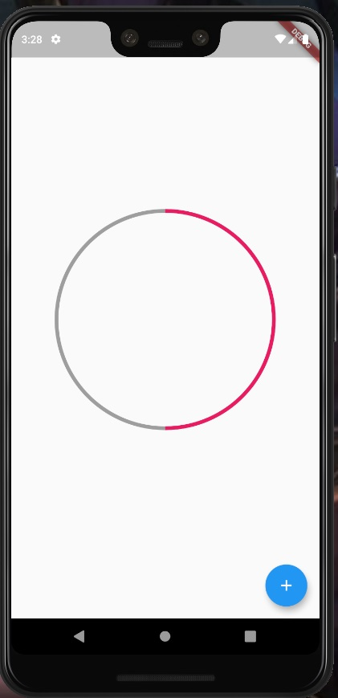

# Flutter Project Circular Progress Indicator

Creating a widget from scratch. (No third libraries)

## Implementation

First we need a widget who contains a `CustomPaint` widget with painter parameter

**Example**

```dart
        Container(
            padding: EdgeInsets.all(5),
            width: 300,
            height: 300,
            //This class should be used
            child: CustomPaint(
              painter: _CustomPaint(porcentage),
            ),
          ),
```

Next step you need create a class that inherit from CustomPainter and make the next configurations

**Example**

```dart
//To draw shape use always a CustomPainter
class _CustomPaint extends CustomPainter {
  final int porcentage;

  _CustomPaint(this.porcentage);

  @override
  void paint(Canvas canvas, Size size) {
    //To draw something we neeed
    final paint = new Paint()
      //Cascade notation
      ..strokeWidth = 5
      ..color = Colors.grey
      ..style = PaintingStyle.stroke;

    //Shape position
    final center = Offset(size.width / 2, size.height / 2);
    //Coordenates in center

    //Return the lesser number of two numbers
    final radius = min(size.width / 2, size.height / 2);
    //Explation: When the shape dimensions  changes the circle maintains the radius to dont get out of the shape

    canvas.drawCircle(center, radius, paint);

    //Bow
    final paintBow = new Paint()
      //Cascade notation
      ..strokeWidth = 5
      ..color = Colors.pink
      ..style = PaintingStyle.stroke;

    //Porcentage to Fill
    double bowAngle = 2 * pi * (porcentage / 100);
    // 2 * pi means a complete circle. When this one is split  by 100 means the porcentage to fill of the bow

    canvas.drawArc(
        //The same values of the circle. Make match
        Rect.fromCircle(
          radius: radius,
          center: center,
        ),
        //The bow begin to start to draw
        -pi / 2,
        bowAngle,
        false,
        paintBow);
  }

  @override
  bool shouldRepaint(CustomPainter oldDelegate) => true;
}
```

The result is




## Animation

To get an animation we need a controller and a AnimationBuilder. (If you need know more you can check the documentation or blogs)

[Check the complete example here](lib/widgets/circular_progress_animate.dart) :thumbsup:


